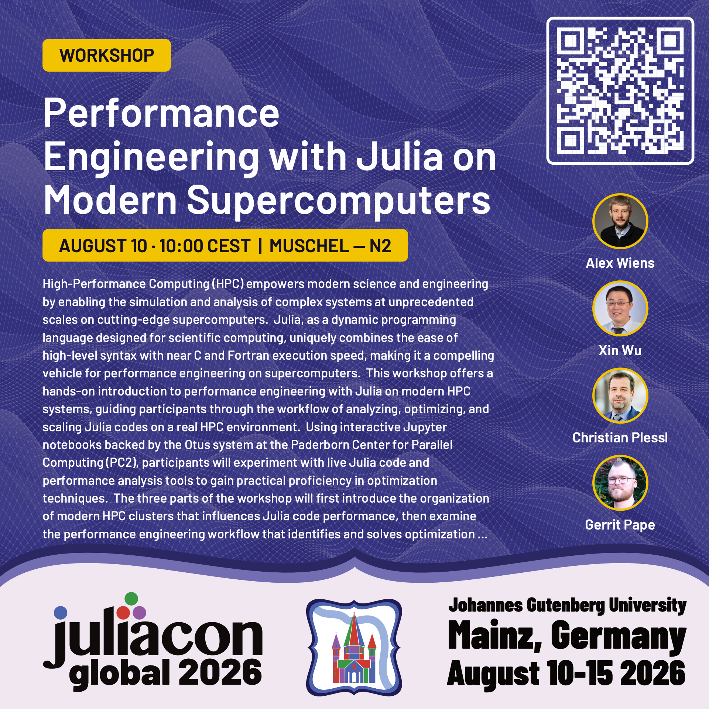

# Performance Engineering with Julia on Modern Supercomputers

Workshop at [JuliaCon 2026](https://juliacon.org/2026/) about Performace Engineering with Julia for High-Performance Computing.

**Location**: [JuliaCon 2026 at Johannes Gutenberg University](https://juliacon.org/2026/#venue)

**Date**: 2028-08-10 10:00 - 13:00

**Workshop event page**: [https://pretalx.com/juliacon-2026/talk/7JKGJU/](https://pretalx.com/juliacon-2026/talk/7JKGJU/)

Sections:

1. Demystifying Modern Supercomputers and Processor Architectures

2. Performance Engineering Workflow in Julia

3. Case Study: Molecular Dynamics Simulation of Liquid Argon (ArgonMD)

  

